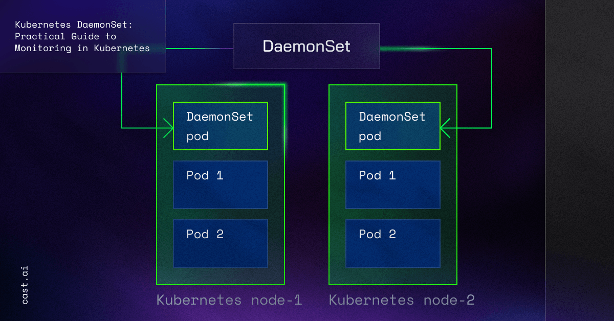

# DaemonSet
# 1. DaemonSet là gì?
**DaemonSet** là controller dùng để đảm bảo rằng mỗi node (hoặc một nhóm node được chọn) sẽ luôn chạy đúng một Pod cụ thể nào đó.
**Ví dụ:** Kubernetes cluster gồm nhiều node, có những Pod mà node nào cũng cần (agent thu thập log, agent monitor, agent security,...). Khi đó tạo một `DaemonSet`, Kubernetes sẽ đảm bảo các Node luôn có Pod đó.
<div align="center">
  
</div>

# 2. DaemonSet Specs
```yaml
apiVersion: apps/v1
kind: DaemonSet 
metadata:
  name: ssd-monitor
spec: 
  selector:
    matchLabels:
      app: ssd-monitor    # DaemonSet này sẽ quản lý các Pod có label app:ssd-monitor
  template:   # Template để tạo ra các Pod
    metadata:
      labels:
        app: ssd-monitor   # Các Pod được tạo có label app:ssd-monitor
    spec:
      nodeSelector:   # Tạo DaemonSet Pod trên các Node có label disk:ssd
        disk: ssd 
      containers:
      - name: main
        image: luksa/ssd-monitor
```
