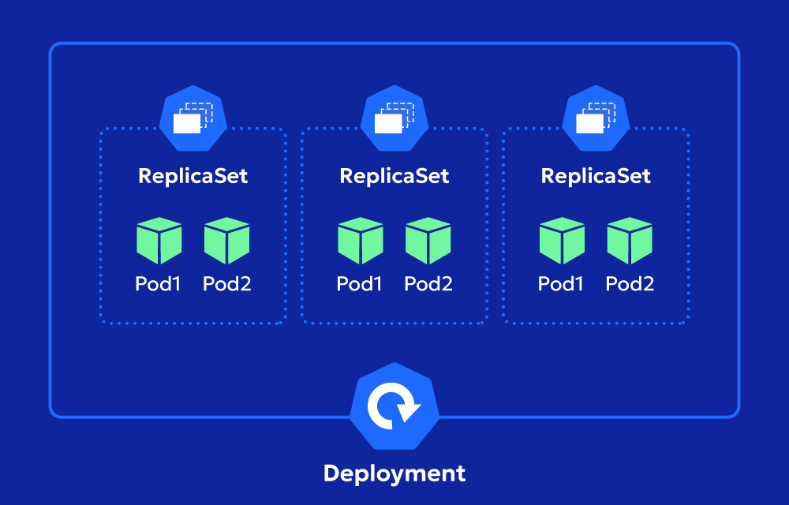
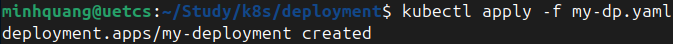
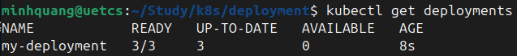
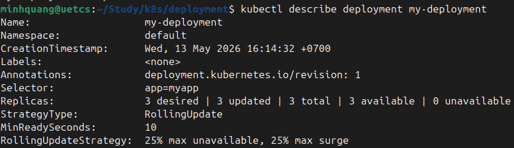
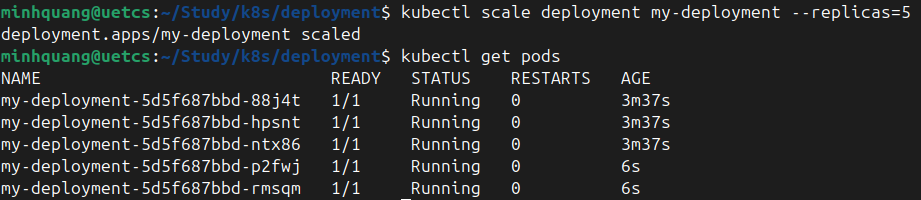

# Kubernetes Deployment
# 1. Định nghĩa
**Deployment** là một controller Kubernetes quản lý việc triển khai và cập nhật Pods một cách declarative.
- Sử dụng **ReplicaSet** để duy trì số lượng Pods mong muốn.
- Hỗ trợ rollout (cập nhật dần dần), rollback (quay lại phiên bản cũ) và scaling (tăng/giảm replicas).
- Phù hợp cho các ứng dụng Stateless.

# 2. Mối quan hệ với ReplicaSet
- **ReplicaSet:** Chỉ duy trì replicas, không hỗ  trợ update (nếu thay đổi template, phải tạo RS mới).
- **Deployment:** Quản lý nhiều RS (mỗi update tạo RS mới), hỗ trợ các chiến lược Rolling Update hoặc Recreate.
<div align="center">
  
</div>

# 3. Deployment Specs
```yaml
apiVersion: apps/v1
kind: Deployment
metadata:
  name: my-deployment
spec:
  replicas: 3
  selector:
    matchLabels:
      app: myapp
  template:  # Giống RS
    metadata:
      labels:
        app: myapp
    spec:
      containers:
      - name: nginx
        image: nginx:1.14
  strategy:  # Update strategy
    type: RollingUpdate  # Hoặc Recreate (kill all then create)
    rollingUpdate:
      maxSurge: 25%  # Số Pods thêm tối đa (int hoặc %)
      maxUnavailable: 25%  # Số Pods unavailable tối đa
  minReadySeconds: 10  # Thời gian chờ Pod ready trước khi coi success
  revisionHistoryLimit: 10  # Giữ bao nhiêu RS cũ cho rollback
  paused: false  # Pause rollout (optional)
```
# 3. Một số câu lệnh làm việc với Deployment
- Tạo Deployment:
```bash
kubectl apply -f nginx-deployment.yaml
```
<div align="center">
  
</div>

- Get/List Deployment:
```bash
kubectl get deployments
```
<div align="center">
  
</div>

- Describe:
```bash
kubectl describe deployment <deployment_name>
```
<div align="center">
  
</div>

- Scale:
```bash
kubectl scale deployment <deployment_name> --replicas=<number>
```
<div align="center">
  
</div>

- Rollout Management:
```bash
# Status
kubectl rollout status deployment/my-dep
# History
kubectl rollout history deployment/my-dep
# Rollback
kubectl rollout undo deployment/my-dep --to-revision=2
# Pause/Resume
kubectl rollout pause deployment/my-dep
kubectl rollout resume deployment/my-dep
```
- Delete Deployment:
```bash
kubectl delete deployment my-dep
```
