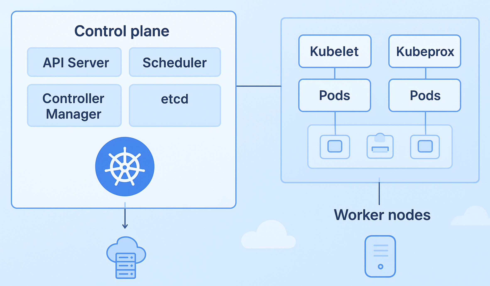
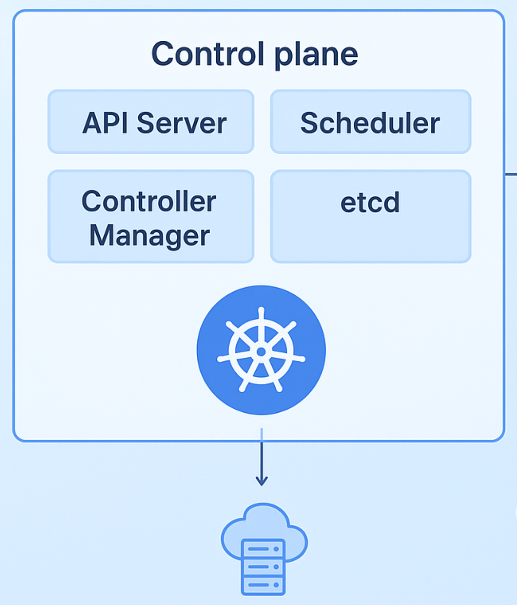
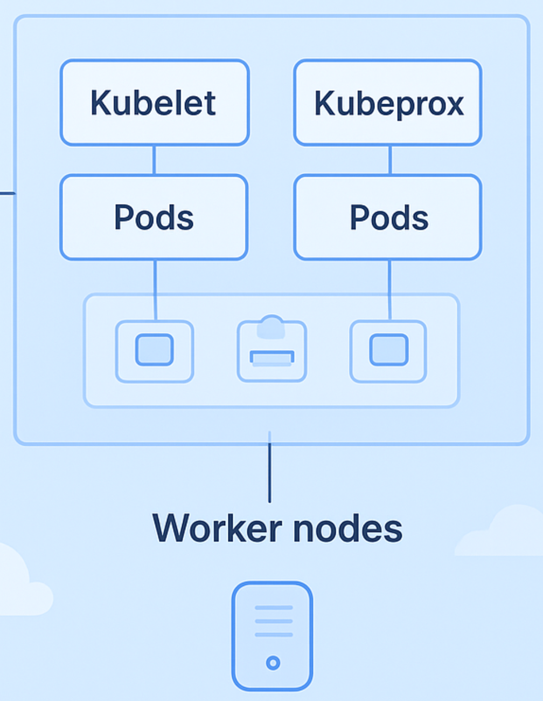

# Introduction to Kubernetes (K8s)
## 1. Kubernetes là gì?
> **Kubernetes** là một nền tảng orchestration (điều phối) container mã nguồn mở, dùng để:
> - Deploy ứng dụng containerized
> - Quản lý container
> - Auto Scaling
> - Load Balancing
> - Rolling Update
> - Quản lý networking, storage, secret, config

## 2. Tại sao Kubernetes xuất hiện
- Trước đây, ứng dụng thường chạy trực tiếp trên server vật lý, máy ảo (VM). Dẫn đến vấn đề khó scale, deploy chậm, môi trường prod/dev khác nhau, downtime cao, khó rollback,...
- Sau đó, **Docker** sinh ra để giải quyết việc đóng gói app + dependency vào container, theo tiêu chí "Build once, run anywhere". Nhưng khi số lượng container tăng lên (deploy 100 microservices), sẽ rất khó để  quản lý, tối ưu resource, phải SSH vào từng server và chạy docker,...
- **Kubernetes** được sinh ra để tự động hóa việc triển khai, quản lý và điều phối container trên nhiều server. Kubernetes giúp scale ứng dụng, tự động restart container lỗi, cân bằng tải, rolling update, quản lý networking/storage và vận hành hệ thống container ở quy mô lớn một cách hiệu quả.

## 3. Kubernetes Architecture

### 3.1 Kubernetes Cluster
**Kubernetes Cluster** là toàn bộ hệ thống Kubernetes bao gồm:
- **Control Plane:** Dùng để điều khiển và quản lý toàn bộ cluster.
- **Worker Nodes:** Là máy vật lý/ VM cung cấp tài nguyên để chạy Pod.
### 3.2 Control Plane

  

#### 3.2.1 `kube-apiserver`
Đây là thành phần trung tâm của cluster, mọi thứ trong Kubernetes đều đi qua nó, tất cả các component đều nói chuyện thông qua `kube-apiserver`. Có vai trò:
- Nhận request
- Validate request
- Authenticate
- Authorize
- Expose REST API
#### 3.2.2 `etcd`
Đây là distributed key-value database, lưu toàn bộ cluster state bao gồm: *Pods, Deployments, ConfigMaps, Secrets, Nodes, Services, RBAC, networking,...*
#### 3.2.3 `kube-scheduler`
Đây là thành phần quyết định xem Pod sẽ chạy ở node nào. Scheduler sẽ xem xét *resource, constraints, policies* từ đó chọn ra node phù hợp để chạy Pod.
#### 3.2.4 `kube-controller-manager`
Đây là thành phần điều khiển có vai trò quản lý và thực hiện giám sát liên tục Kubernetes Cluster. Thực hiện *Quan sát tình trạng hiện tại $\to$ So sánh với yêu cầu $\to$ Sửa cho đúng yêu cầu*.
### 3.3 Worker Node
**Worker Node** là máy chủ vật lý/ VM giúp cung cấp tài nguyên để chạy Pod, đây là nơi workload thực sự chạy.

  

#### 3.3.1 `kubelet`
Đây là agent chạy trên mỗi node trong cluster, thực hiện một số công việc như:
- Đảm bảo các container ở trạng thái running trong Pod.
- Lắng nghe thông tin của các Pod, áp dụng các cơ chế để Pod chạy đúng theo yêu cầu.
- Cập nhật trạng thái của các Pod và thông tin của Pod, sau đó gửi về Control Plane.

#### 3.3.2 `kube-proxy`
Đây là thành phần quản lý networking cho Service, quản lý và duy trì các network rule trên các node. Đảm bảo kết nối đến từ các pod bên ngoài/bên trong cluster.

#### 3.3.3 Pods
Là đơn vị triển khai (deployment unit) nhỏ nhất mà Kubernetes quản lý. Một Pod thường chứa:
- Một hoặc nhiều container
- Shared network
- Shared storage
- Lifecycle chung