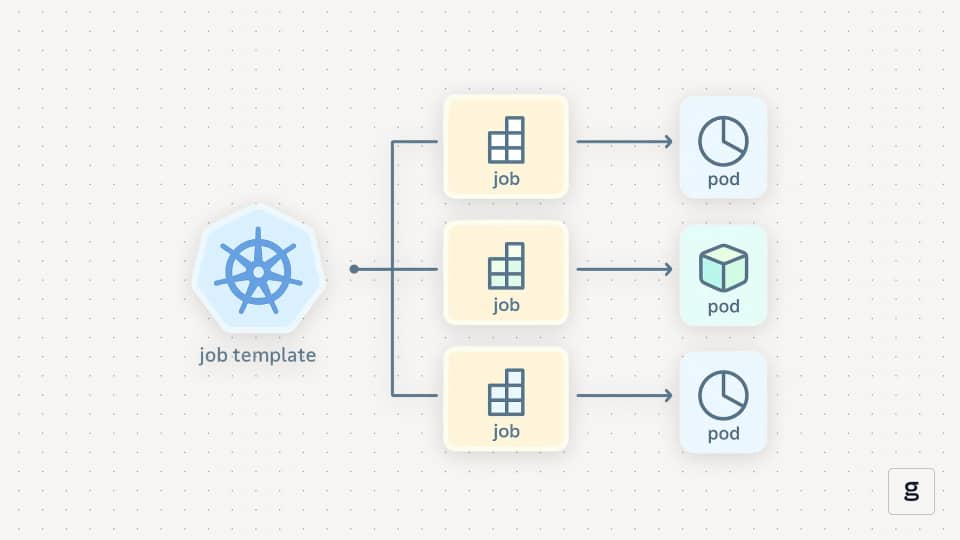
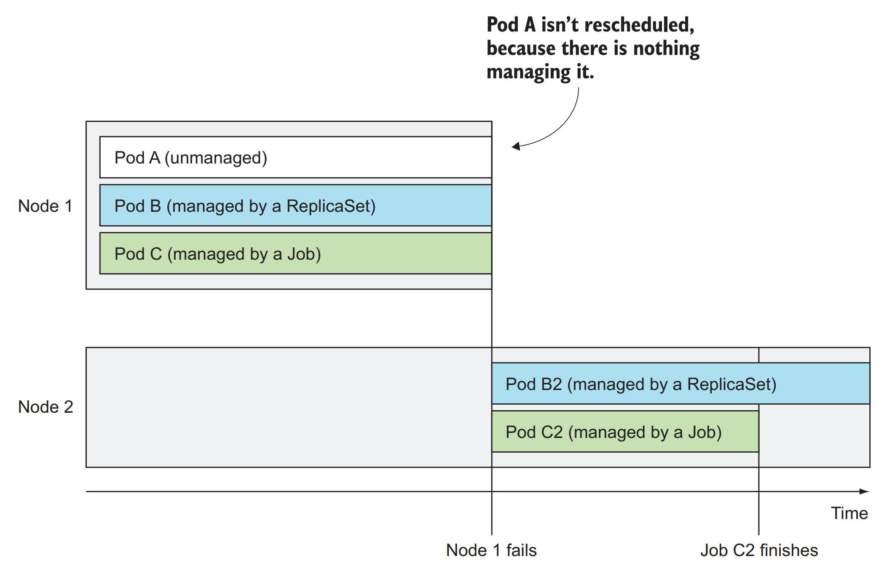
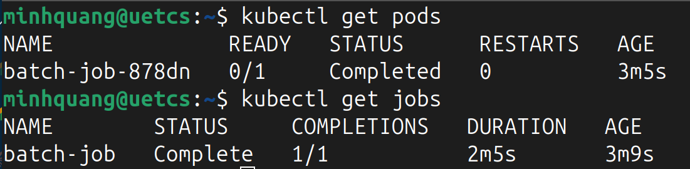

# Kubernetes Jobs
## 1. Định nghĩa
`Job` là workload dùng để chạy một tác vụ hữu hạn, chạy xong thì kết thúc. Ví dụ như *Script chạy một lần, Batch Processing, Migration, ETL, backup,...* 
- `Job` là một controller quản lý một hoặc nhiều Pod.
- `Job` cho phép chạy Pod mà container bên trong sẽ không bị khởi động lại khi tiến trình kết thúc hoặc thành công.
- Nếu Pod chết nhưng tác vụ chưa được hoàn thành, `Job` sẽ tạo Pod mới và chạy lại tác vụ.

<div align="center">
  
</div>

<div align="center">
  
</div>

## 2. Job Specs
```yaml
apiVersion: batch/v1
kind: Job
metadata: 
  name: batch-job
spec:
  completions: 5
  parallelism: 2
  template:
    metadata:    # Cho Job biết Pod được tạo là gì
      labels:
        app: batch-job
    spec:      
      restartPolicy: OnFailure
      containers:
      - name: main
        image: luksa/batch-job
```



- Nếu chỉ có `completions` thì Job sẽ được chạy **tuần tự** theo số lần đã chỉ định.
- Nếu thêm `parallelism` thì sẽ có n pod chạy **song song** nhau cho đến khi thực hiện đủ số lần `completions`. 
- Để giới hạn thời gian cho phép chạy Task thì thêm `activeDeadlineSeconds` vào Pod specs.
- Để scale số lượng `parallelism` khi Job đang chạy, sử dụng lệnh sau:
```bash
kubectl scale job <job_name> --replicas <number>
```
