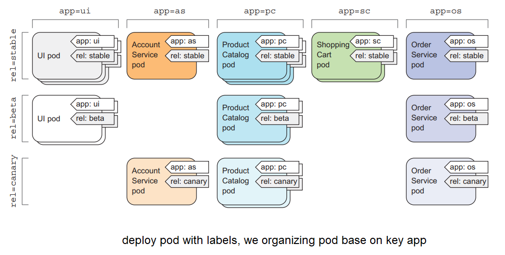
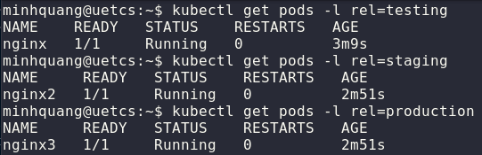

# Labels and Annotations
# 1. Labels
**Labels** là cách để phân chia các pod khác nhau tuỳ thuộc vào dự án hoặc môi trường. Ví dụ, công ty có 3 môi trường là *testing, staging, production*, nếu chạy Pod mà không gán label thì khó để biết pod nào thuộc vào môi trường nào.

Để định nghĩa label  cho Pod, sử dụng thuộc tính `metadata.labels` và đặt tên theo cặp `<key>: <value>`:
```yaml
apiVersion: v1
kind: Pod
metadata:
  name: nginx1
  labels:
    rel: testing
spec:
  containers:
  - name: nginx
    image: nginx

----
apiVersion: v1
kind: Pod
metadata:
  name: nginx2
  labels:
    rel: staging
spec:
  containers:
  - name: nginx
    image: nginx

----
apiVersion: v1
kind: Pod
metadata:
  name: nginx3
  labels:
    rel: production
spec:
  containers:
    - name: nginx
      image: nginx

```

Để lấy container theo label sử dụng câu lệnh:
```bash
kubectl get pods -l <label>
```
<div align="center">
  
</div>

# 2. Annotations
`Annotations` là cơ chế để gắn metadata tuỳ ý vào Kubernetes objects, chủ yếu dùng để *lưu metadata, cấu hình tool/controller, service discovery, integrations, observability,...*
```yaml
metadata:
  name: mypod

  annotations:
    description: "backend api pod"
    owner: "platform-team"
```