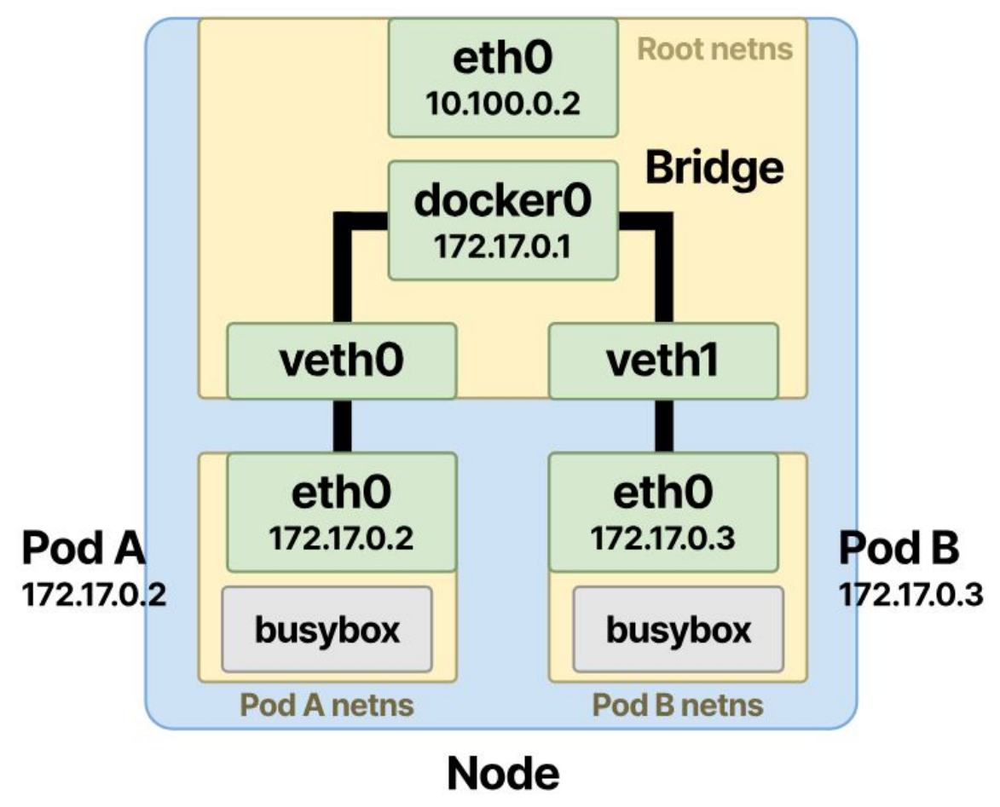
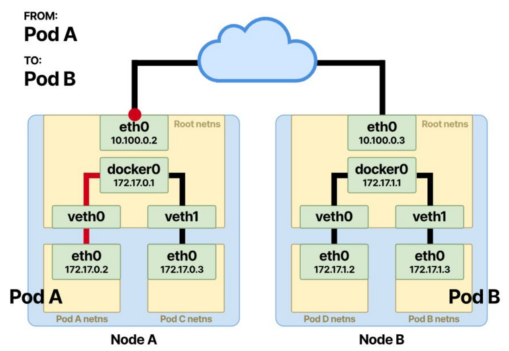

# Kubernetes Service
## 1. Pod-to-Pod Communication
**Pod-to-Pod Communication** là cơ chế truyền thông nội bộ cho phép các Pod trao đổi dữ liệu trực tiếp với nhau trong một Cluster. Kubernetes cung cấp cho mỗi Pod một địa chỉ IP duy nhất trên toàn bộ cluster.
- Các Pod giao tiếp trực tiếp mà không cần NAT
- Tránh xung đột Port do có IP độc lập, nhiều Pod có thể cùng lắng nghe trên một Port cố định trên cùng 1 Node mà không xung đột
- Địa chỉ IP mà một Pod tự nhận diện cấu hình của chính nó cũng chính xác là địa chỉ IP mà các Pod khác trong Cluster sử dụng để gọi đến nó.
### 1.1 Giao tiếp cùng Node

  

- Khi Kubernetes tạo Pod, CNI sẽ tạo một *Network Namespace* riêng cho Pod đó. Mỗi namespace có *Routing Table, Interface, IP, ARP Table* riêng.
- Sau đó CNI sẽ tạo 1 cặp veth pair, với 1 đầu nằm trên Pod, 1 đầu nằm trên Node và được gắn vào Linux Bridge trên root namespace của Node.
- Linux Bridge hoạt động giống switch Layer2 và quyết định frame đi ra cổng nào sử dụng thuật toán ARP
### 1.2 Giao tiếp khác Node

  

## 2. Services
> **Service** là tài nguyên dùng để cung cấp một địa chỉ truy cập ổn định cho một nhóm Pod. Pod có thể phải nhận request từ các Pod bên trong cluster hoặc client ở bên ngoài cluster. Pod cần có một cơ chế để tìm các Pod khác nếu nó muốn sử dụng dịch vụ của các Pod đó.
> - **Pod** không ổn định, nó có thể bị xoá, restart, scale up/down bất cứ lúc nào, khi đó Pod mới sẽ có IP khác.
> - **Pod IP** chỉ được cấp sau khi Scheduling, Kubenetes không biết Pod sẽ chạy ở đâu cho đến khi Scheduler quyết định.
> - **Pod** có thể horizontal scaling, nếu có nhiều replica của Pod thì client sẽ không biết phải gọi ai.

- **ClusterIP** dùng khi các pod trong cluster cần giao tiếp với nhau
- **NodePort** mở pod cho các node được chỉ định, dùng khi các dịch vụ ngoài internet/ngoài cluster muốn truy cập vào các pod trong cluster. Truy cập thông qua `<Node_IP>:<Port>`.
- **LoadBalancer** che giấu địa chỉ IP nội bộ của Pod, thay vào đó expose domain để truy cập vào Pod.
## 3. Ingress Controller & API Gateway
## 3.1 Vấn đề nếu chỉ dùng LoadBalancer
Mỗi **Service** phải sử dụng 1 LoadBalancer gây ra tốn kém chi phí

## 4. CNI
**CNI** có các tác dụng:
- Routing giữa các node trong cluster
- Cấp phát IP cho Pod khi được tạo
- Đảm bảo Pod-to-Pod communication
- Đảm bảo Pod-to-Node communication

## 5. Storage
Pod chỉ quan tâm có PVC hay không
Xoá Pod thì PVC và PC không mất
Xoá PVC thì PC mất

