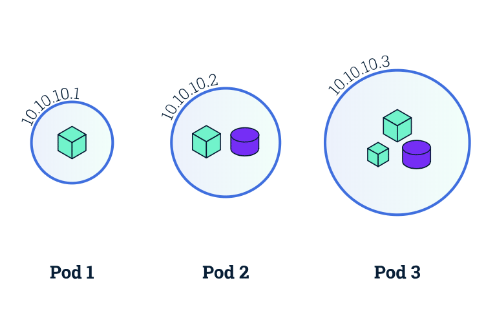
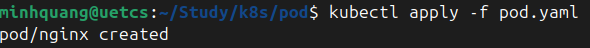
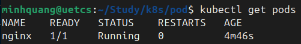
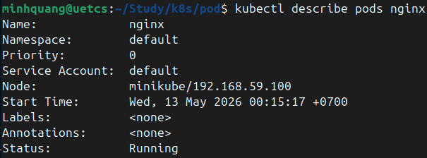
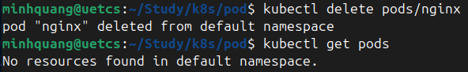
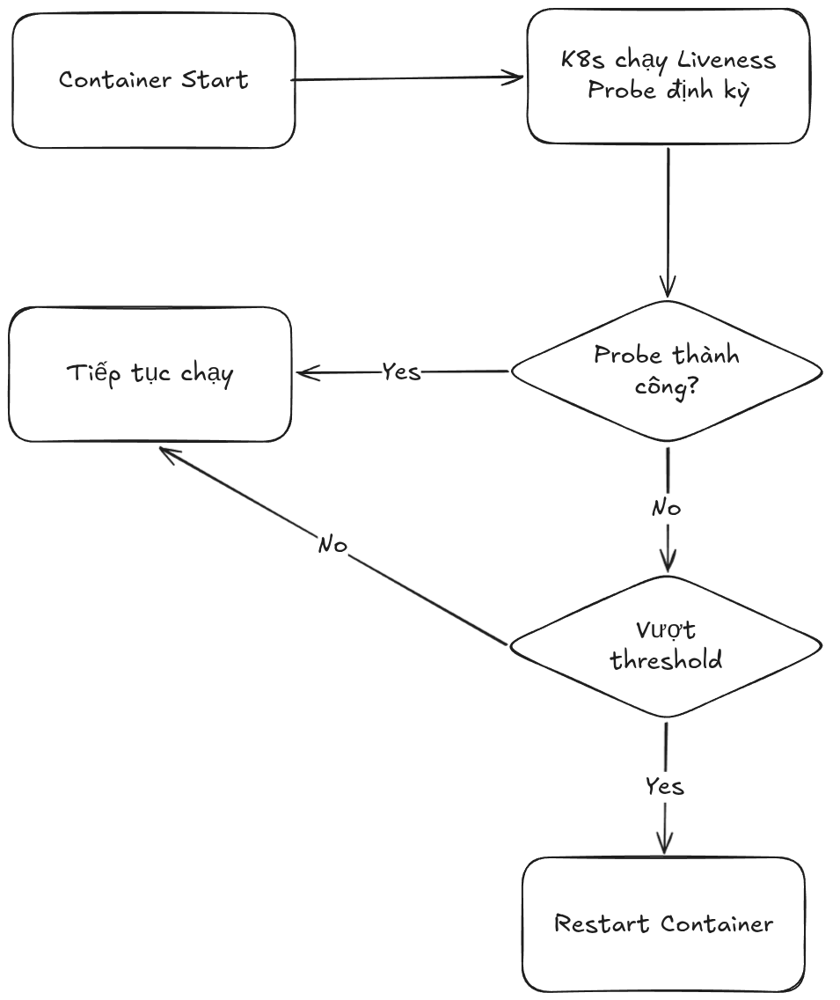
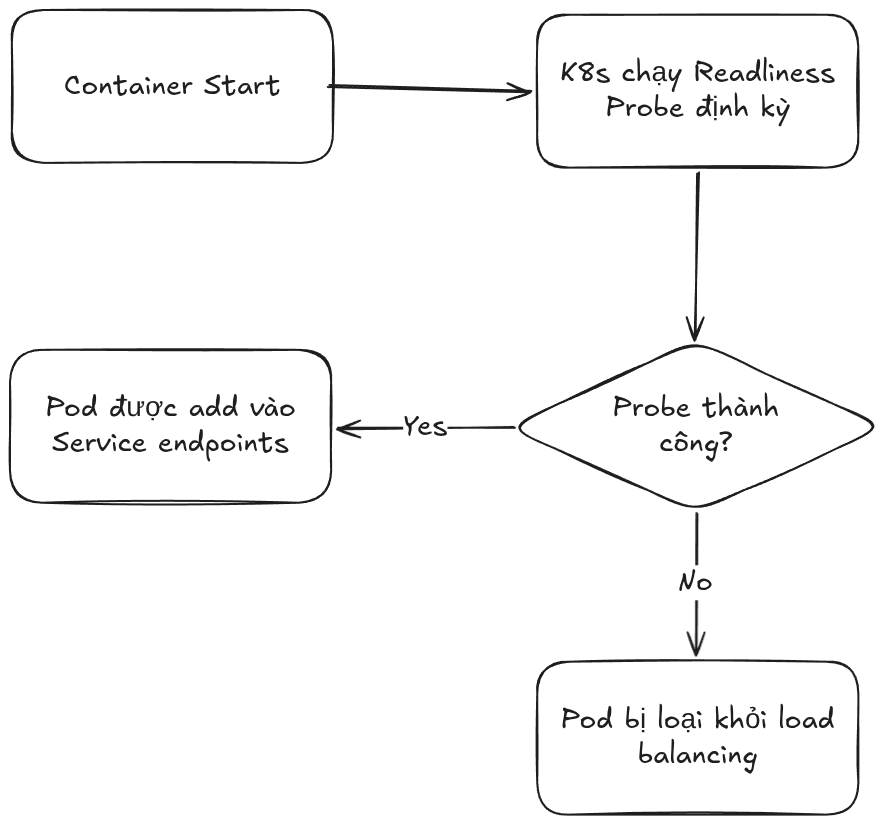

# Kubernetes Pod
# 1. Định nghĩa
**Pod** là đơn vị triển khai nhỏ nhất và cơ bản nhất mà Kubernetes quản lý. Không phải một container riêng lẻ mà là tập hợp gồm một hoặc nhiều container ứng dụng và các volume lưu trữ, chạy trung trong cùng một môi trường thực thi.
- Kubernetes coi mỗi Pod như một server độc lập. Nếu 2 Pod chạy trên cùng 1 node vật lý, chúng vẫn bị tách biệt gần giống như chạy trên 2 server khác nhau.
- Các container nằm trong cùng một Pod sẽ chạy trong các cgroup riêng biệt nhưng chia sẻ nhiều namespace (của Linux).
- Các container nằm trong cùng một Pod luôn được đặt và chạy trên cùng 1 server vật lý hoặc VM.

<div align="center">
  
</div>

# 2. Tư duy thiết kế Pod
Để quyết định xem nên gom nhiều container vào 1 Pod hay tách ra nhiều Pod thì cần phải xác định xem *Các container này có hoạt động đúng cách không nếu chúng được đặt trên các node khác nhau?*, *Hai container này có cần phải luôn sống cùng nhau không?*.
- **Kubernetes** coi 1 Pod = 1 Logical host, bên trong Pod có thể có 1 hoặc nhiều container. Nhưng tất cả phải có cùng lifecycle, chạy cùng node, scale cùng nhau, share network, share storage,... 
- **Scale Unit** có nghĩa là **Scale Pod** chứ không phải là scale các container riêng lẻ.
```
Pod
 ├── app
 └── sidecar
```
Scale từ *1 $\to$ 10* replicas có nghĩa là:
```
10 Pod
 ├── app
 └── sidecar
```

# 3. Pod Manifest
**Pod Manifest** là file `YAML` dùng để mô tả *Muốn tạo Pod như thế nào?*. Đây là declarative config, chỉ cần đưa ra trạng thái mong muốn, **Kubernetes** sẽ đảm bảo trạng thái được thực hiện.
**Pod Manifest** thường bao gồm 4 phần sau:
- `apiVersion`: Cho Kubernetes biết object này dùng API version nào.
- `kind`: Xác định loại object (`Pod`, `Deployment`, `Service`, `ConfigMap`, `Secret`, `StatefulSet`,...)
- `metadata`: Thông tin mô tả Object
- `labels`: Dùng để grouping, filtering,...
- `spec`: Chỉ định Pod phải chạy như thế nào
- `containers`: Danh sách container trong Pod
```yaml
apiVersion: v1
kind: Pod
metadata:
  name: nginx-pod

spec:
  containers:
    - name: nginx
      image: nginx:latest
      ports:
        - containerPort: 80
```
# 4. Running Pod
Để tạo Pod thông qua **Pod Manifest**, sử dụng lệnh sau:
```bash
kubectl apply -f pod.yaml
```
<div align="center">
  
</div>

Để list ra danh sách các Pod, sử dụng lệnh sau:
```bash
kubectl get pods
```
<div align="center">
  
</div>

Để xem thông tin chi tiết của Pod, sử dụng lệnh sau:
```bash
kubectl describe pods <pod_name>
```
<div align="center">
  
</div>

Để xoá Pod, sử dụng lệnh sau:
```bash
kubectl delete pods/<pod_name>
kubectl delete -f pod.yaml
```
<div align="center">
  
</div>

# 5. Accessing Pod
## 5.1 Expose port cho Pod
Mặc định, khi Pod được tạo nó sẽ không mở port để nhận bất kỳ traffic nào. Để mở port của Pod ra ngoài, có thể dùng *Service Resource* hoặc `kubectl port-forward`:
```bash
kubectl port-forward <resource> <local-port>:<pod-port>
```
## 5.2 Lấy Logs của Pod
Để lấy Logs hiện tại của Pod, sử dụng câu lệnh:
```bash
kubectl logs <resource>
```
Nếu muốn lấy logs real time thì thêm flag `-f`
## 5.3 Chạy command trong container của Pod
```
# Non-interactive
kubectl exec <resource> -c <container_name> <command>

# Interactive
kubectl exec -it <resource> -c <container_name> <shell>
```
## 5.4 Copy files vào hoặc ra từ Container
Để copy từ máy Local $\to$ Pod:
```bash
kubectl cp <local-path> <pod>:<container-path> -c <container_name>
```
Để copy từ Pod $\to$ máy Local:
```bash
kubectl cp <pod>:<container-path> <local-path> -c <container_name>
```
# 6. Health Checks
**Kubernetes** có cơ chế tự động health check, nếu process chính sập thì sẽ tự động restart container. Tuy nhiên, nếu process xảy ra hiện tượng như deadlock thì **Kubernetes** sẽ vẫn nghĩ rằng nó đang hoạt động.
Vì vậy, **Kubernetes** tạo ra *Liveness health check* để kiểm tra xem app có đang thực sự hoạt động.
## 6.1 Liveness Probe
**Liveness Probe** là cơ chế để **Kubernetes** kiểm tra xem ứng dụng bên trong Container còn hoạt động đúng hay không. Nó được định nghĩa cho mỗi container, mỗi container được health-check riêng biệt.
<div align="center">
  
</div>

```
apiVersion: v1
kind: Pod

metadata:
  name: myapp

spec:
  containers:
    - name: app
      image: myapp:1.0

      ports:
        - containerPort: 8080

      livenessProbe:
        httpGet:
          path: /health
          port: 8080

        initialDelaySeconds: 15
        periodSeconds: 10
        timeoutSeconds: 2
        failureThreshold: 3
```
Sau đó, trong app cần có 1 endpoint `/health` để thực hiện health-check, ví dụ:
```java
@GetMapping("/health")
public ResponseEntity<String> health() {
    return ResponseEntity.ok("OK");
}
```
## 6.2 Readliness Probe
**Readliness Probe** dùng để xác định **Container đã sẵn sàng nhận traffic chưa?*, nếu chưa thì nó sẽ bị xoá khỏi *service load balancers*.
<div align="center">
  
</div>

```yaml
apiVersion: v1
kind: Pod

metadata:
  name: myapp

spec:
  containers:
    - name: app
      image: myapp:1.0

      ports:
        - containerPort: 8080

      readinessProbe:
        httpGet:
          path: /ready
          port: 8080

        initialDelaySeconds: 5
        periodSeconds: 10
        timeoutSeconds: 2
        failureThreshold: 3
```
Sau đó, trong app cần có 1 endpoint `/ready`, ví dụ:
```java
@GetMapping("/ready")
public ResponseEntity<String> ready() {
    if (applicationReady) {
        return ResponseEntity.ok("READY");
    }

    return ResponseEntity.status(503).build();
}
```
# 7. Resource Management
**Resource Management** là cơ chế kiểm soát việc CPU, memory và tài nguyên hệ thống được phân bố, giới hạn và sử dụng như thế nào giữa *Pods, Containers, Nodes,...* Nếu không quản lý resource, một container có thể chiếm hết RAM/CPU của node.
## 7.1 Resource Request: Minimum Required Resources
Chỉ định resource tối thiếu mà container yêu cầu, dùng để quyết định xem pod sẽ được đặt lên node nào.
```yaml
apiVersion: v1
kind: Pod
metadata:
 name: kuard
spec:
 containers:
 - image: gcr.io/kuar-demo/kuard-amd64:blue
   name: kuard
   resources:
     requests:
       cpu: "500m"
       memory: "128Mi"
    ports:
      - containerPort: 8080
        name: http
        protocol: TCP
```
## 7.2 Limits
Chỉ định resource tối đa mà container được phép dùng.
```yaml
apiVersion: v1
kind: Pod
metadata:
 name: kuard
spec:
 containers:
 - image: gcr.io/kuar-demo/kuard-amd64:blue
   name: kuard
   resources:
     limits:
       cpu: "1"
       memory: "512Mi"
    ports:
      - containerPort: 8080
        name: http
        protocol: TCP
```
# 8. Persisting Data with Volumes
Mặc dù container đã có filesystem/volume rồi, nhưng nó chỉ là tạm thời. Container có thể bị destroy hoặc restart bất cứ lúc nào, dẫn đến dữ liệu của container bị mất. 
**Kubernetes** thiết kế volume theo mô hình:
- Pod sở hữu volume
- Container sử dụng volume

Để định nghĩa volume cho Pod, sử dụng `spec.volumes`. Để mount volume vào filesystem của container, sử dụng array `volumeMounts`:
```yaml
apiVersion: v1
kind: Pod
metadata:
 name: kuard
spec:
 volumes:
   - name: "kuard-data"
     hostPath:
       path: "/var/lib/kuard"
 containers:
   - image: gcr.io/kuar-demo/kuard-amd64:blue
     name: kuard
     volumeMounts:
       - mountPath: "/data"
         name: "kuard-data"
     ports:
       - containerPort: 8080
         name: http
         protocol: TCP
```