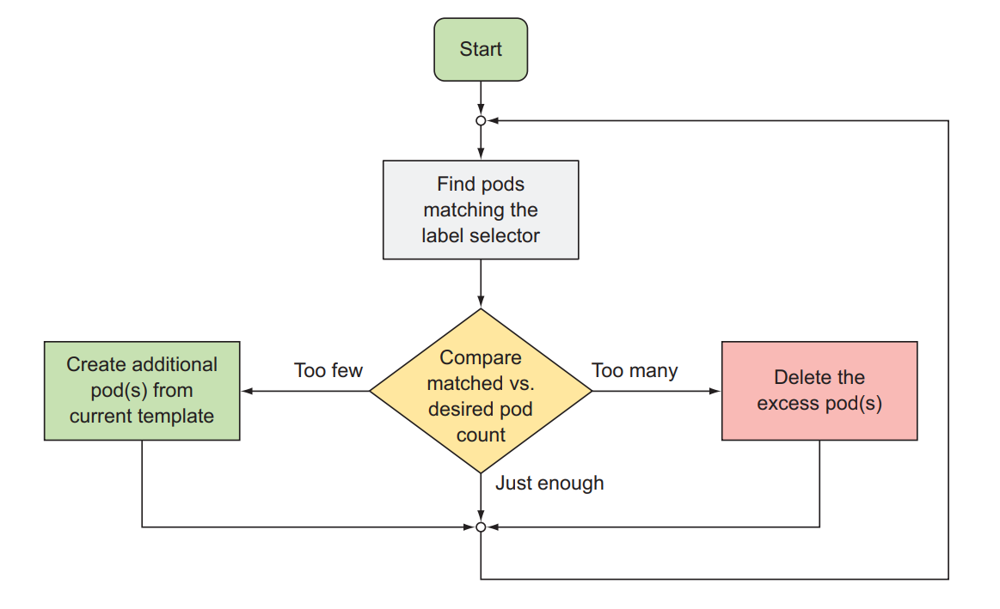
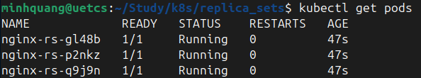
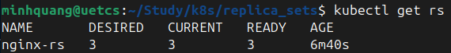
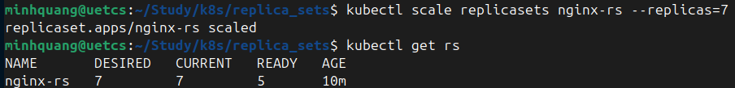
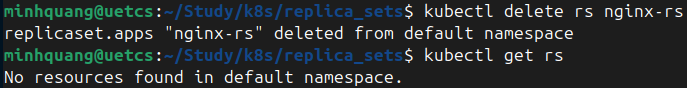

# ReplicaSet
# 1. Định nghĩa
- **ReplicaSet** là object có nhiệm vụ đảm bảo luôn có đúng số lượng Pod đang chạy như mong muốn.
- **ReplicaSet** không sở hữu Pod mà quản lý Pod thông qua `labels` + `selectors`
- Pod có thể crash/sập, nếu Pod sập thì Kubernetes không tự động tạo lại, nếu node chết thì Pod cũng mất theo. Vì vậy, **ReplicaSet** sinh ra để giải quyết vấn đề này.
 
**Ví dụ:** Muốn luôn có 3 Pod chạy app backend
- Nếu 1 Pod bị crash hoặc node chết $\to$ ReplicaSet sẽ tự tạo Pod mới để bù lại.
- Nếu muốn scale lên 10 Pod $\to$ ReplicaSet sẽ tạo thêm 7 POD.

<div align="center">
  
</div>

<div align="center">
  
</div>

# 2. ReplicaSet Spec
```yaml
apiVersion: apps/v1
kind: ReplicaSet
metadata:
  name: my-rs
  labels:
    app: myapp
spec:
  replicas: 3  # Số lượng Pods
  selector:
    matchLabels:  # Equality-based
      app: myapp
  template:  # Pod template
    metadata:
      labels:
        app: myapp
    spec:
      containers:
      - name: nginx
        image: nginx:1.14
        ports:
        - containerPort: 80
```
- `replicas`: số lượng Pod mong muốn
- `selector`: cách tìm Pod thuộc ReplicaSet
- `template`: specs của Pod

Để tạo **ReplicaSet**, sử dụng lệnh sau:
```bash
kubectl apply -f rs.yaml
```
<div align="center">
  
</div>

# 3. Một số câu lệnh làm việc với ReplicaSet
- Xem tất cả các Replica Set trong cluster:
```bash
kubectl get rs
```
<div align="center">
  
</div>

- Scaling ReplicaSets (sử dụng lệnh này hoặc sửa trong file YAML):
```bash
kubectl scale replicasets <rs_name> --replicas=<number>
```

- Xóa ReplicaSet:
```bash
kubectl delete rs <rs_name>
```
